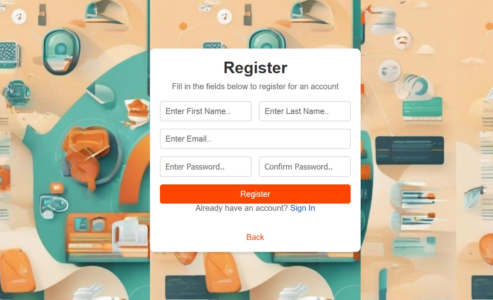
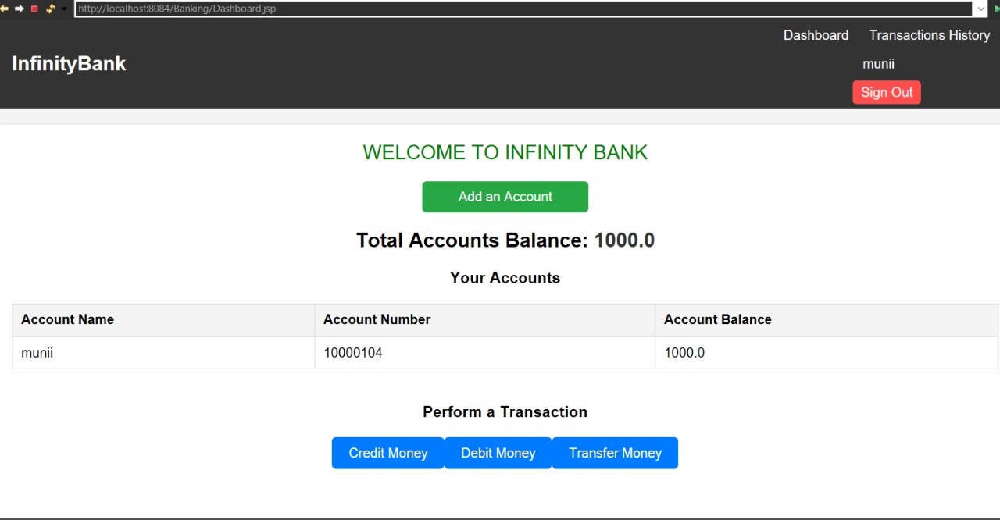
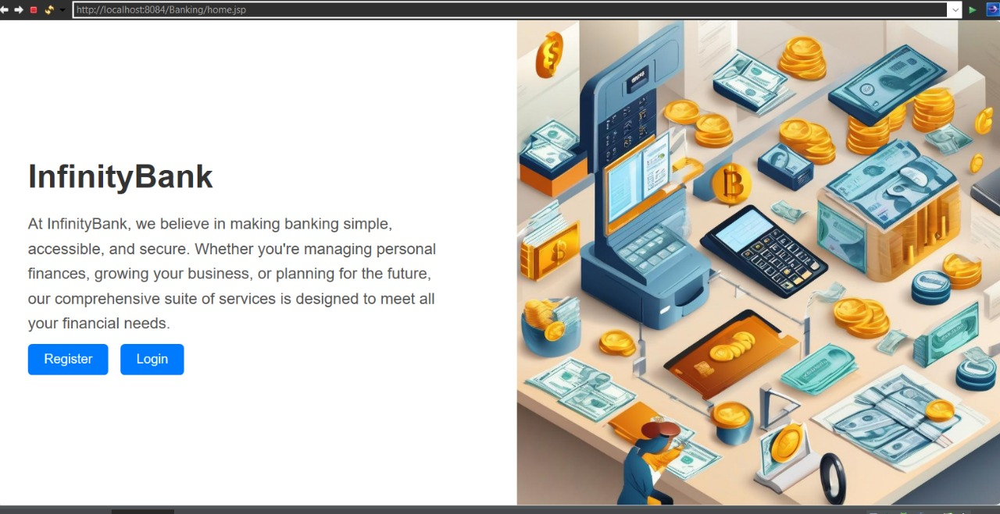
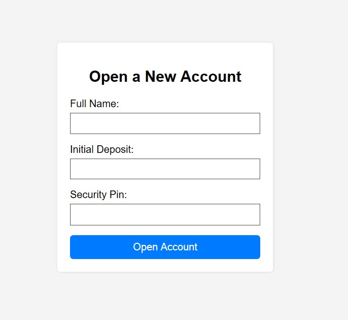
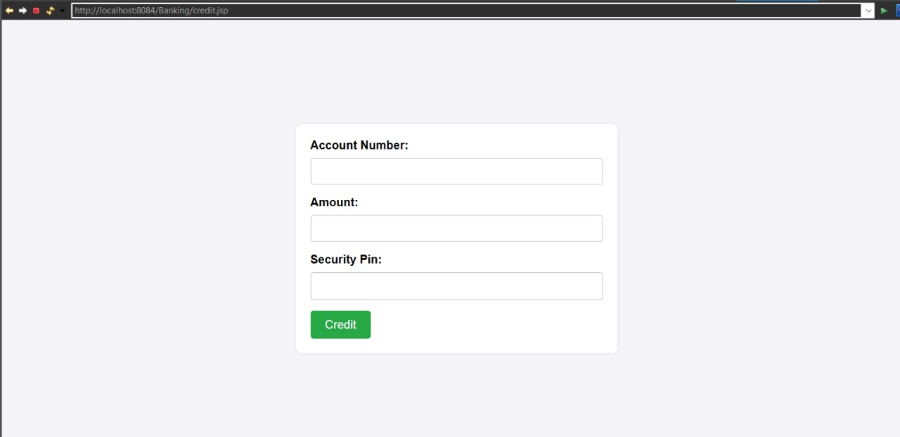

# Banking Management System

## Project Overview
The Banking Management System aims to simplify and secure various banking operations, including account creation, transactions, and administrative management. This project is ideal for managing small to medium-sized banking needs.

## Features
- Account Management: Create, update, and manage user accounts.
- Transaction Handling: Perform secure debit, credit, and transfer operations.
- Admin Portal: Access to manage user accounts and view transaction history.

## Technologies Used
- **Backend**: Java, Servlets, JDBC
- **Frontend**: JSP, HTML, CSS, JavaScript
- **Database**: MySQL
- **Security**: bcrypt for password encryption
- **Apache Tomcat** (or another servlet container) to run the application

### Prerequisites
- **Java**: JDK 17 or later
- **Tomcat Server**: Version 10 or later
- **MySQL**: Version 8 or later

## Project Structure
The project uses **Java** for the backend, **JDBC** for database interaction, and **JSP** for the frontend interface. The system is connected to an online/cloud database for real-time data management.

## Screenshots

### 1. Login Page

### 2. User Dashboard

### 3. Account Creation

### 4. Open new account

### 5. Credit Funds

